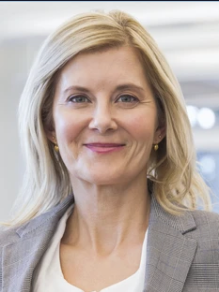

## Keynote Speakers

NetSci2025 is proud to present an esteemed lineup of keynote speakers from around the world, offering valuable insights and expertise in the field of Network Science.

### TBA

**TBD**

### TBA

**TBD**

### TBA

**TBD**
